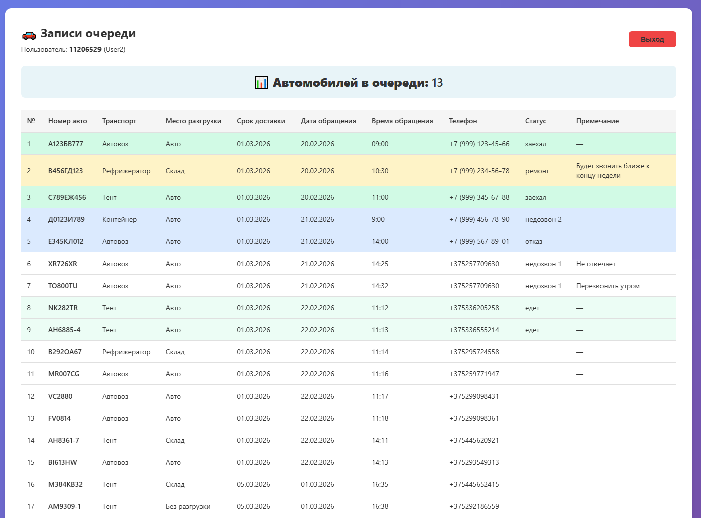
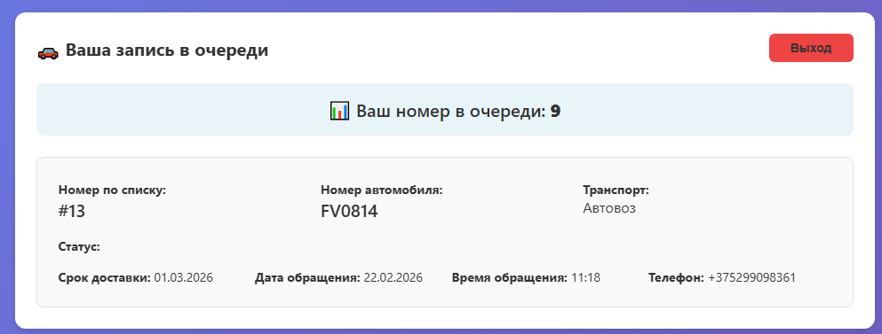

# Koleyka — сервис управления очередью автомобилей на въезд

**Введение (лид):** Koleyka — это веб-сервис для учёта и управления очередью автомобилей на въезд на территорию. Система показывает актуальную очередь, считает количество машин перед въездом, ведёт статусы (едет, заехал, недозвон, отказ и др.) и даёт разный доступ разным ролям: администратору, руководителю, дежурному по КПП, контролёру и водителю. Работает в браузере на компьютере и на смартфоне.

---

## Для кого предназначен сервис Koleyka

Koleyka рассчитан на организации, у которых есть контролируемый въезд (КПП, склад, производственная площадка) и нужно:

- вести единую очередь машин на въезд;
- видеть, сколько автомобилей в очереди и кто уже заехал;
- давать доступ водителям только к своей позиции в очереди;
- давать дежурным по КПП возможность добавлять и редактировать записи и менять статусы;
- хранить данные о транспорте, месте разгрузки (склад, авто, без разгрузки) и примечаниях.

---

## Как устроена работа по ролям

Вход в сервис выполняется по номеру (коду). По этому номеру система определяет тип пользователя и открывает нужный раздел.

### Администратор (полный доступ)

- Доступ ко всем таблицам базы данных.
- Просмотр и редактирование справочников (пользователи, категории, места разгрузки и т.п.).
- Настройка данных для работы остальных ролей.

### Руководитель (только просмотр очереди)

- Просмотр полной таблицы очереди записей.
- Видно количество автомобилей в очереди (с учётом исключённых статусов: недозвон 2, отказ, заехал).
- Нет прав на добавление и редактирование.

### Дежурный по КПП (редактирование очереди)

- Просмотр очереди.
- Добавление новых автомобилей в очередь.
- Редактирование записей: транспорт, место разгрузки, срок доставки, статус, примечание и др.
- При добавлении записи с номером автомобиля в системе автоматически создаётся учётная запись водителя (для просмотра своей позиции).

### Контролёр КПП (список авто, которым разрешён въезд)

- Просмотр списка автомобилей, которым разрешён въезд.
- Удобный формат для просмотра со смартфона на посту.

### Водитель (своя позиция в очереди)

- Вход по номеру автомобиля.
- Просмотр только своей записи и позиции в очереди.
- Отображается количество машин перед ним .

---

## Основные возможности таблицы очереди

- **Номер в очереди** — порядковый номер записи.
- **Номер автомобиля** — идентификатор машины (для водителя по нему выполняется вход).
- **Транспорт** — тип транспорта (выбор из списка).
- **Место разгрузки** — склад, авто, без разгрузки и др. (список из справочника, по умолчанию — «Склад»).
- **Срок доставки, дата и время обращения** — для планирования и отчётности.
- **Телефон** — контакт водителя/заявки.
- **Статус** — едет, заехал, недозвон 1/2, отказ, ремонт, звонить утром и т.д.
- **Примечание** — произвольный текст.

Строки в таблице подсвечиваются по статусу: например, «заехал» — зелёным, «едет» — светло-зелёным, «недозвон 2» и «отказ» — синим, «ремонт» — жёлтым. Это упрощает визуальный контроль на экране.

---

## Технологии и размещение

Koleyka построен на связке **Next.js**, **Prisma** и **PostgreSQL** (Neon). Интерфейс — веб, адаптированный под мобильные устройства. Развёртывание возможно на **Vercel** с подключением к облачной базе данных, что позволяет не содержать собственный сервер.

---

## Краткий итог

Koleyka — это специализированный сервис управления очередью автомобилей на въезд с разграничением прав по ролям, подсчётом очереди, статусами и справочниками (транспорт, место разгрузки). Он подходит для КПП, складов и территорий с контролируемым въездом и может использоваться как с компьютера, так и со смартфона.

